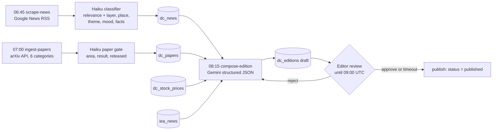

# AI Data Centers Daily Snapshot — PRD

2026-09-22 · @Someone · Draft v0.1

## Summary

We are adding a second output to the AI Data Centers epic: a **daily snapshot edition**, frozen once a day at 08:15 UTC, that curates the previous 24 hours of AI, energy and sustainability news into one page. Unlike the live epic (a map with the latest data layered on top), an edition never changes after it is published; corrections run in the next one, and every edition stays reachable forever.

The page is synthesis-first: a headline and subheading for the day, a Doom v Boom mood reading, metric-led key notes, then four chapters (geography, AI layer, research, AI + energy) that each open with their own headline and a bespoke visualisation, with the underlying stories one click away in a slide-over panel. Every claim links back to its source; every paper links to arXiv.

One-line goal: **someone who reads vizmaya for ten minutes each morning knows what happened in AI yesterday, from every angle, and can trace every claim to its source.**

The design is settled and now lives in the app: **`/ai-daily/doom-v-boom/sample`** renders the fixture through the real components, and is the reference for how an edition should look. (It began as a standalone mockup — [AI Data Centers Daily](https://claude.ai/artifact/NZzr32a55v1RQiTjV63gcW), once `docs/ai-data-centers-daily-snapshot.html` — which was retired once the components caught up, because a reference nothing renders drifts from what ships without anyone noticing.) This PRD covers what it took to ship it on the existing vismay stack.

## Background

Today the epic has three things and no daily surface for readers. The **explorer** (`/ai-data-centers`) is a Mapbox map of Epoch AI's facility registry with a detail sheet per site. The **news pipeline** (`scripts/ai-data-centers/scrape-news.ts`, cron 06:45 UTC) pulls Google News RSS across four queries and runs a Claude Haiku relevance gate that tags each row with `topics[]` (ai, data-centers, semiconductors, microprocessors) and `tickers[]`. The **recap worker** (`generate-news-recap.ts`, cron 08:15 UTC) writes a Gemini markdown brief into `dc_news_recaps`, but nothing public renders it; only the admin Pipeline and Recaps tabs do.

Alongside sit `dc_stocks` / `dc_stock_prices` (29 tickers in four categories: data-centers, hyperscalers, semiconductors, semi-equipment) and the Energy Profile epic's `iea_news`. The snapshot reuses all of this and changes three things:

1. The classifier tags more: a **layer**, a **place + region**, a **theme** and a **mood** per story, in the same Haiku call that already runs.
2. The recap worker becomes an **edition composer** that writes a structured edition row (headline, sub, key notes, per-layer briefs, figures) instead of one markdown blob, and a new **papers ingest** feeds it arXiv.
3. A public route renders editions, and the admin gets an **Editions** tab to review before the freeze becomes visible.

The stock categories are already the four AI layers the design uses, so no new taxonomy is needed there.

## Users and jobs

The reader is someone who needs to be current on AI without reading forty articles a day: an operator, an investor, an analyst or a policy person. They come to us as the curator, not the feed.

| Reader | Job to be done | What the edition must give them |
| --- | --- | --- |
| Operator / builder (data-center, cloud, hardware) | Know what changed in supply, power and permitting yesterday | Layer chapter, capacity and power figures, geo map |
| Investor / analyst | Read the day's mood and the moves behind it, with sources | Doom v Boom, key notes with numbers, ticker tape, source list |
| Researcher / ML engineer | See which papers matter and why, without opening arXiv | Research chapter: result, scale, what was released, why it matters |
| Policy / sustainability | Track power, grid, water and rules across regions | AI + Energy chapter, geo region bar, IEA join |
| Editor (internal) | Review and approve an edition before it goes public | Admin Editions tab, editable headline / notes, freeze control |

The first four never see anything live; they see the frozen edition and the archive. The editor sees the draft between the composer run and the freeze.

## Goals, metrics and non-goals

**Goals for v1**

1. One edition per day, published automatically at 08:15 UTC, never edited after publish.
2. Every headline, note and figure traceable to a linked source; every paper linked to arXiv.
3. Every section readable at the summary level without opening a story; every summary one click from its stories.
4. Editions render as a static page (no Mapbox, no client data fetch) so they are cheap, cacheable and exportable.

**Success metrics (first 90 days)**

| Metric | Target |
| --- | --- |
| Editions published on schedule | 100% of days, with the deterministic fallback counting |
| Editor edits per edition before freeze | Under 3 (proxy for composer quality) |
| Source-link click-through per session | 2 or more |
| Returning readers (7-day) | 35% of readers who saw 2 editions |
| Median time on edition | 4 minutes or more |
| Panel opens per session | 3 or more |

**Non-goals for v1**

- Real-time updates within a day (that is the live epic's job).
- Personalisation, saved preferences or accounts for readers.
- Editing an edition after it is public; corrections are a line in the next edition.
- Covering AI news outside the epic's feed queries; widening the feed is a separate change.
- Email delivery; the page must be email-ready (static, self-contained) but sending is phase 2.

## Edition anatomy

An edition is one page with a masthead, a hero, a ticker tape, seven chapters and an archive rail. Every chapter opens at the summary level; every summary opens the slide-over panel with its stories. The table is the spec for what each part renders and where its data comes from.

| Part | What it shows | Data source | Opens in panel |
| --- | --- | --- | --- |
| Masthead | Edition navigator (‹ date ›, edition number, "frozen 08:15 UTC"), Doom v Boom chip, share | `dc_editions` | — |
| Chapter nav | Sticky scroll-spy over the seven chapters | static | — |
| Hero | Eyebrow (window, counts), 24-hour headline, subheading | `dc_editions.headline`, `.sub`, counts | — |
| Ticker tape | Day's close vs prior close for all active tickers, sorted by move | `dc_stock_prices` | — |
| I · Doom v Boom | Reports of one development grouped into an event and counted once; each event weighted by relevance × impact × coverage; reading = (W_boom − W_doom) / (W_boom + W_doom). Needle, 7- and 30-day ghost ticks, per side the event count, its share of the weight and the top 3 events | `dc_news.mood`, `.relevance`, `.impact`, `.event`, `.actors`; `dc_editions.mood_score`, `.mood_counts.events` | Doom side, boom side (one row per event) |
| II · Key notes | Six notes, each led by the number that matters, with source chips | `dc_editions.notes[]` (metric, label, text, sources\[\]) | — |
| III · By geography | Full-bleed dot-matrix world map (canvas), pins sized by story count, hover tooltip, proportional region bar with layer micro-bars | `dc_news.place`, `.region`, `dc_places` | Place, region |
| IV · By AI layer | Four tiles: layer headline + sub, one bespoke viz per layer, three sourced notes, count | `dc_editions.layers[]`, per-layer viz data | Layer |
| V · New research | Research headline + sub; fields moved (today vs 30-edition avg); openness bars; results-at-scale scatter; 8 result-led paper cards | `dc_papers`, `dc_editions.research` | Paper, field |
| VI · AI + Energy | 4.6 GW-style hero figure, source-composition bar, power-per-edition bars (last 7), three figure tiles, "open the stories" card, Energy Profile links | `dc_editions.energy` (figures\[\]), `dc_news.energy`, `iea_news` | Energy stories |
| VII · Sources | Every link in the edition grouped by outlet, numbered | derived from all of the above | — |
| Previous editions | Rail of the last 4 editions with headline and counts; current one highlighted | `dc_editions` | — |
| Slide-over panel | Right-side panel (480 px, full-width on phones): eyebrow, title, sub, story rows (headline, outlet, time, layer, tickers, domain link); paper detail variant with result / scale / released tiles | `dc_news`, `dc_papers` | — |

**Per-layer visualisations** (all drawn from what the day's stories state, none from prices):

| Layer | Viz | Inputs |
| --- | --- | --- |
| Data centers | Capacity on the move: MW added per site vs items paused / frozen (hatched when no MW given) | `dc_news.figures[]` with unit MW, `.action` in (add, pause, freeze) |
| Hyperscalers | Who moved on what: company × action matrix (power deal, capacity, permit, pause, disclosure) | `dc_news.tickers[]` × `.action` |
| Semiconductors | HBM allocation horizon: per-supplier booked-out window on a 2026–2028 timeline, plus point events | `dc_news.horizon` (from, to) per ticker |
| Semi equipment | Orders moving in time: pull-forwards as arrows, windows as bars, risks in the negative colour | `dc_news.horizon`, `.action` in (pull-forward, risk) |

The visual language is fixed by the mockup: `app/ai-data-centers/theme.ts` steel/cyan tokens, a lime accent reserved for energy, rose for negatives; Newsreader for display, IBM Plex Sans and Mono for body and data; a light theme derived from the same tokens.

## Data model

Three new tables and six new columns on `dc_news`, all in one migration (`078_dc_editions.sql`). `dc_news_recaps` stays for the admin timeline; editions supersede it for the public.

**`dc_news` additions** (written by the classifier in the same call that sets `topics` and `tickers`):

| Column | Type | Values |
| --- | --- | --- |
| `layer` | text | `dc` · `hyper` · `semi` · `equip` (matches `dc_stocks.category`) |
| `place` / `region` | text / text | free place slug from `dc_places`; region in `na` · `ea` · `eu` · `me` · `other` |
| `theme` | text | `power` · `permit` · `memory` · `capacity` · `equip` · `chips` · `sustain` |
| `mood` | smallint | `-1` doom · `0` neutral · `1` boom |
| `energy` | boolean | true when the story carries a power, grid, water or carbon claim |
| `facts` | jsonb | `{action, figures:[{value, unit, label}], horizon:{from, to}}` — what the layer visualisations read |

**`dc_places`** — `slug`, `name`, `region`, `lat`, `lng`. Seeded with the \~20 places the feed keeps naming; the classifier picks from this list or `null`, so pins never need geocoding at render time.

**`dc_papers`** — one row per arXiv paper in the window: `arxiv_id` (PK), `title`, `authors`, `affiliations`, `kind` (`lab` · `academic` · `mixed`), `category`, `area` (`reason` · `arch` · `infer` · `multi` · `align` · `evalb`), `bench`, `baseline`, `result`, `unit`, `compute_bucket` (0–3), `scale`, `weights_released`, `code_released`, `why`, `tags[]`, `relevant`, `published_at`.

**`dc_editions`** — one row per published edition; the row is the page:

| Column | Type | Notes |
| --- | --- | --- |
| `id` / `number` | uuid / int | edition number is sequential and public |
| `edition_date`, `window_start`, `window_end` | date, timestamptz | window is 08:15 → 08:15 UTC |
| `status` | text | `draft` · `published`; only one draft at a time |
| `headline`, `sub` | text | 24-hour headline and deck |
| `notes` | jsonb | 6 × `{metric, unit, label, text, sources:[{name, url}], energy}` |
| `mood_score`, `mood_counts` | numeric, jsonb | reading and `{boom, doom, neutral}` — event counts since `method: 'events-v1'`, which also carries the raw report counts, the side weights and every event `{lead, ids, mood, w, r, i, outlets}` |
| `layers` | jsonb | per layer `{headline, sub, notes:[{text, sources}], viz}` |
| `research` | jsonb | `{headline, sub, paper_ids[], field_baseline}` |
| `energy` | jsonb | `{hero:{value, unit, label}, composition:[{label, gw}], figures:[{value, unit, label}]}` |
| `story_ids`, `paper_ids` | uuid\[\], text\[\] | the frozen membership; the page never re-queries by window |
| `model`, `generated_at`, `reviewed_by`, `published_at` | text, timestamptz… | provenance |

Freezing is `status = 'published'` plus the membership arrays. Because the page renders from the row and the arrays, later changes to `dc_news` (re-classification, deletions) cannot change a published edition.

## Pipeline

The daily run stays on GitHub Actions and keeps its two existing crons; a third job ingests papers and the recap job becomes the composer. The classifier change is a prompt and schema change, not a new call.

The draft goes public at 09:00 UTC whether or not an editor has looked at it; review is a window, not a gate, so the cron never goes dark.

**Classifier (scrape-news.ts).** Extend the structured-output schema with `layer`, `place` (from the seeded list), `region`, `theme`, `mood` and `facts`. Keep the relevance gate and the vocabulary check; rejects still persist with `relevant=false`. Backfill the last 30 days once so the mood sparkline and field baselines have history.

**Papers ingest (new `ingest-papers.ts`).** Query the arXiv API for `cs.AI`, `cs.CL`, `cs.LG`, `cs.CV`, `cs.AR`, `cs.DC` submitted in the window, then a Haiku gate that keeps papers with a data-center-scale or frontier-AI bearing and extracts `area`, `bench`, `baseline`, `result`, `unit`, `compute_bucket`, `scale`, `weights_released`, `code_released` and a one-line `why`. Target 6–10 kept papers a day; upsert on `arxiv_id`.

**Composer (replaces generate-news-recap.ts).** One Gemini call in JSON mode over the window's relevant stories, kept papers, stock moves and `iea_news`, returning `headline`, `sub`, `notes[6]`, `layers{}` with headline / sub / notes, and `research{headline, sub}`. Everything numeric (mood score, counts, figures, composition, field baselines, per-layer viz data) is assembled deterministically from the tagged rows, never by the model. On any model failure the composer falls back to a deterministic edition (headline from the top theme, notes from the largest figures) and marks `model = 'deterministic'`, exactly as the recap worker does today.

**Freeze.** `publish-edition` (09:00 UTC, or the admin's Publish button) sets `status = 'published'`, `published_at`, and revalidates `/ai-daily/doom-v-boom` and `/ai-daily/doom-v-boom/[date]`. A published row is never updated; a correction is a note in the next edition.

## API and routes

Readers go through `packages/content-source/src/epics.ts`, the same place `getDcNews` and `getLatestDcNewsRecap` live, so both apps share them.

| Route | Returns | Cache |
| --- | --- | --- |
| `GET /ai-daily/doom-v-boom` | Latest published edition (page) | static, revalidated on publish |
| `GET /ai-daily/doom-v-boom/[date]` | That day's edition; 404 if none | static, immutable once published |
| `GET /api/ai-data-centers/editions?limit=` | `{ editions: [{number, date, headline, counts, mood_score}] }` for the archive rail and navigator | `s-maxage=3600` |
| `GET /api/ai-data-centers/editions/[date]` | Full edition row plus the resolved stories and papers in its membership arrays | `s-maxage=86400`, immutable |
| `GET /api/vizmaya/editions/draft` (admin) | The current draft with the same shape | no cache, `isAuthed()` |
| `PUT /api/vizmaya/editions/draft` (admin) | Patch `headline`, `sub`, `notes`, `layers.*.headline/sub/notes`, `research.headline/sub` | `isAuthed()` |
| `POST /api/vizmaya/editions/draft/publish` (admin) | Freeze now, revalidate public routes | `isAuthed()` |
| `POST /api/vizmaya/editions/draft/recompose` (admin) | Re-run the composer on the same window (appends a run, keeps editor edits unless cleared) | `isAuthed()` |

New readers in `epics.ts`: `getEdition(date)`, `getLatestEdition()`, `listEditions(limit)`, `getDraftEdition()`, `saveDraftEdition(patch)`, `publishDraftEdition()`, `getMoodSeries(days)`, `listPapersForEdition(ids)`. The existing `/api/ai-data-centers/recap` stays until the admin Recaps tab is retired.

## Frontend

The page is a server component tree under `apps/vizmaya-fyi/app/ai-daily/doom-v-boom/` that renders one edition row into static HTML; the only client code is the panel, the canvas map, scroll-spy and hover. No Mapbox, no ECharts and no client fetch on this route, which is what makes editions cheap to cache and simple to export.

| Component | Role | Client? |
| --- | --- | --- |
| `EditionPage` | Layout: masthead, hero, tape, chapters, archive rail, footer | no |
| `EditionNav` | Date stepper and chapter scroll-spy | yes (scroll-spy only) |
| `DoomBoomMeter` | SVG meter, sparkline, driver lists | no (SVG is server-rendered) |
| `KeyNotes` | Six metric-led signals | no |
| `GeoMap` | Canvas dot-matrix map (land mask shipped as a 40 KB flat array), pins, tooltip, region bar | yes |
| `LayerTile` + `layerViz/*` | Tile with headline / sub / notes and one of four SVG visualisations (`CapacityLedger`, `ActionMatrix`, `HorizonTimeline`, `OrderTimeline`) | no |
| `ResearchChapter` | Field dot-plot, openness bars, results-at-scale scatter, paper cards | no |
| `EnergyChapter` | Composition bar, per-edition bars, figure tiles, links to Energy Profile | no |
| `Sources` | Grouped, numbered link list derived from the edition | no |
| `StoryPanel` | Slide-over with story and paper variants, keyboard and focus handling | yes |

Rules that come from the design:

- Every summary element carries a `data-panel` key (`layer:semi`, `place:abilene`, `region:eu`, `paper:2609.11902`, `mood:boom`, `energy`); one delegated handler opens the panel. Keys are the API for "click to detail", so they are also usable as URL hashes for sharing (`#p=layer:semi`).
- Charts are hand-drawn SVG from the edition JSON; no chart library. Text in charts uses theme tokens so both themes read.
- Theme tokens extend `app/ai-data-centers/theme.ts` with `energy`, `down`, the three composition hues and the map dot colours; the epic row's `theme` jsonb override keeps working.
- Fonts: Newsreader + IBM Plex Sans / Mono via `next/font/google`.
- Phone width: map scrolls sideways inside its frame with the region bar below it; layer tiles, signals and paper cards stack; the panel is full-width.
- Reduced motion disables the tape and panel transitions.

The mockup's `index.html` is the reference implementation for all of the above and can be ported component by component.

## Admin: Editions tab

A new tab at `/vizmaya/editions` in `apps/admin`, next to Pipeline and Recaps, is where the editor spends the 08:15–09:00 window. It shows the draft exactly as the public page will render it, with the text fields editable in place.

1. **Draft banner** — window, composer model, generated time, countdown to auto-publish, buttons: Publish now, Recompose, Hold (extends the window by 30 min, once).
2. **Editable text** — headline, sub, the six key notes (metric, label, text), each layer's headline / sub / notes, the research headline / sub. Sources on a note are picked from the stories in the window, never typed.
3. **Membership** — the story and paper lists with a checkbox to drop an item from the edition (it stays in `dc_news`, just not in `story_ids`); dropping re-derives the numeric parts.
4. **Diff to previous run** — when Recompose is used, a side-by-side of old vs new text so an editor does not lose manual edits by accident.
5. **Archive** — the list of published editions with headline, mood score, counts and model; read-only.

Audit: every save writes a row to `ai_generations` (kind `edition_edit`) with the editor and the patch, using the table that already exists for image generation.

## Non-functional requirements

- **Performance.** An edition page ships under 250 KB gzipped including the land mask and fonts, with no client data fetch; LCP under 2.0 s on a mid-range phone. Published editions are statically generated and never revalidate; only `/daily` (the alias for latest) revalidates on publish.
- **Sharing and SEO.** Each edition has a stable URL by date, an `opengraph-image` rendered from the headline and Doom v Boom reading (reuse the existing `opengraph-image.tsx` pattern), `NewsArticle` JSON-LD via `JsonLd.tsx`, and a `sitemap.ts` entry per edition. Panel keys in the URL hash deep-link a layer, place or paper.
- **Export.** Because the page is static and library-free, the existing render pipeline (`@vismay/content-source` PDF / share-card handlers) can render an edition to PDF and a share card without new dependencies; phase 2 uses this for email.
- **Accessibility.** All interactive marks are buttons or `role=button` with keyboard handlers; the panel is a `dialog` with focus trap and Escape; chart text uses theme tokens; colour never carries meaning alone (doom/boom also labelled, released/closed also badged). Target WCAG 2.1 AA.
- **Provenance.** Every story row and paper carries its source URL; the Sources chapter is derived, not written, so it cannot drift from the body. The composer's model and run time are shown in the footer.
- **Cost.** One extra Haiku field set per story (no extra call), one Haiku call per candidate paper (\~40 a day), one Gemini call per composer run. Well under the existing pipeline's budget.
- **Reliability.** Deterministic fallback for the composer; the papers job failing produces an edition with an empty research chapter and a notice, never a missed edition.

## Milestones

Four phases, each shippable on its own; the public page ships in phase 3.

| Phase | Scope | Exit criterion |
| --- | --- | --- |
| 1 · Tagging | Migration 078; classifier schema + prompt; `dc_places` seed; 30-day backfill | Pipeline tab shows layer / place / theme / mood on every relevant row |
| 2 · Editions | `dc_papers` + `ingest-papers.ts`; composer replaces recap worker; draft + publish jobs; readers in `epics.ts` | A published `dc_editions` row every day for 5 consecutive days |
| 3 · Public page | `/ai-daily/doom-v-boom` and `/[date]`; all components ported from the mockup; OG image, JSON-LD, sitemap | Page live, Lighthouse 90+ on performance and accessibility |
| 4 · Admin + polish | Editions tab with edit, recompose, publish; archive; audit; light theme QA; PDF / share-card export | Editor can approve a draft without touching the database |

Dependencies: phase 2 needs phase 1's tags; phase 3 can start on the mockup while phase 2 runs, using a fixture edition row. The papers ingest is the one new external dependency (arXiv API); it is reachable from Actions, which is where the job runs.

## Open questions and risks

- [ ] **Scope of the feed.** The current four Google News queries are data-center-centric. The research chapter widens to all of AI; should the news feed widen too (models, labs, policy), or does "AI Data Centers Daily" stay the frame?
- [ ] **Edition cadence on weekends.** Sundays have a fifth of the volume. Publish a thinner edition, skip, or roll Saturday and Sunday into Monday's window?
- [x] **Mood scoring.** A story count was crude twice over: one development reported by three outlets was three votes, and a $1M local fine weighed as much as a hyperscaler cancelling gigawatts. Since classifier v4 / migration 080 the composer groups reports into events (deterministic clustering over the title and the classifier's canonical `event` line, tickers and `actors` keeping templated headlines apart) and weighs each event by relevance (0.6–1.0) × impact (grade 1 → 1×, grade 5 ≈ 6.3×; a plan or forecast grades one step below the same thing done) × coverage (damped, capped at 1.75×). The number stays machine-only; the editor's lever is still membership, and the admin shows the grouping.
- [ ] **Place list.** The seeded `dc_places` list needs an owner and a rule for adding places (a story naming a new site should not silently drop its pin).
- [ ] **Naming.** "Edition", "snapshot" and "daily" are used interchangeably in the design; pick one for the URL and the UI.

Risks:

| Risk | Effect | Mitigation |
| --- | --- | --- |
| Composer hallucinates a figure in a note | A wrong number on a page that cannot be edited | Numbers come only from `facts` extracted per story; the model writes prose around them, and the editor window catches the rest |
| arXiv volume swamps the paper gate | Cost and noise | Category filter first, then a cheap title-and-abstract gate before the full extraction |
| Classifier drift changes tags mid-series | Mood sparkline and field baselines shift | Version the prompt; store `classifier_version` on rows; recompute baselines per version |
| Static pages and a late correction | A public error stands for a day | Corrections line in the next edition is the policy; an unpublish switch exists for the rare hard case |
