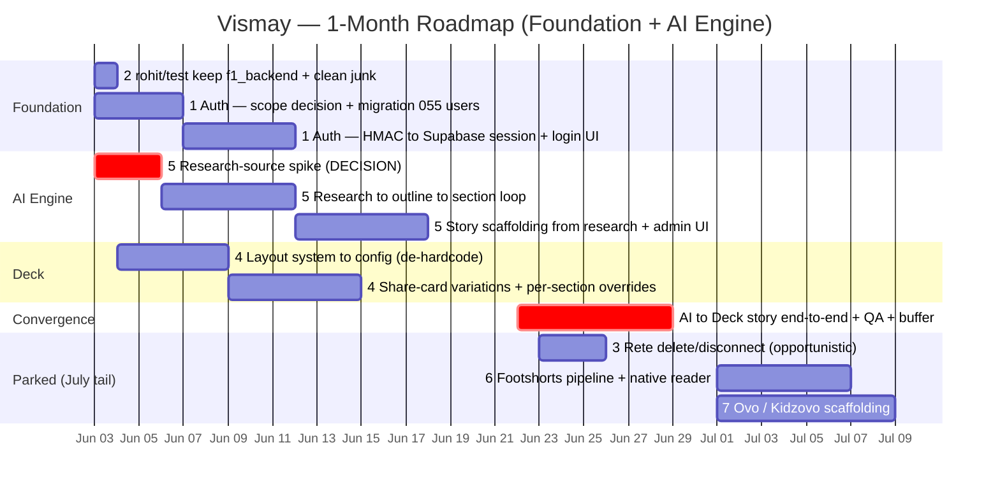

# Vismay — 1-Month Roadmap (June 2026)

**Window:** Jun 3 – Jun 30, 2026 (~4 weeks / ~20 working days)
**Tracks:** 3–4 parallel
**Strategy:** Foundation-first · go deep on the content engine, park the rest
**In-month focus:** ② Rohit integration → ① Auth → ⑤ AI pipeline → ④ Deck
**Payoff:** the generalized content engine producing a Deck-format story end-to-end (vizmaya pack)
**Parked → July tail:** ③ Rete · ⑥ Footshorts · ⑦ Ovo (③ as an opportunistic pickup)

**Related:** [vizf1-integration-vs-roadmap.md](vizf1-integration-vs-roadmap.md) (scoping comparison) · [generalized-content-engine.md](generalized-content-engine.md) (the engine reframe) · [vizf1-ai-pipeline-integration.md](vizf1-ai-pipeline-integration.md) (original spec)

---

## Three findings that reframe the plan

- **① "Auth to viz-admin" actually targets `apps/admin`.** `packages/viz-admin` is a *component library* with no auth boundary — the real auth lives in `apps/admin/lib/adminAuth.ts` (HMAC cookie). `@supabase/supabase-js` is already wired in `packages/content-source` and vizmaya-fyi, so the gap is a users table (migration 055) + a session-store swap, not a from-scratch integration.
- **② rohit/test is purely additive (3 commits, ~36K insertions, 0 deletions).** ⚠️ *Correcting the earlier read:* the bulk is `f1_backend/` — a **fully-populated ~35K-LOC reference implementation** (Python AI pipeline, Express backend, Vite frontend), **not** an empty scaffold, and **no footshorts deps are removed**. It isn't a pnpm-workspace member, so it never builds. This is a **trivial keep-and-clean, not a fraught merge** — and `f1_backend` is the *donor* for the content engine (⑤), not something to drop. Cleanup = delete 3 empty junk files + relocate one stray config.
- **③ The AI engine (⑤) is best built generic-first, with `f1_backend` as a donor — not a vizf1-specific port.** ⑤ becomes one generalized *research→render* engine (`packages/story-pipeline`) that recycles f1_backend's GraphSpec/ContentBlock contract + curation UX (charts rebuilt on ECharts) and ports its grounding heuristics as the trust spine; each vertical is a thin `DomainPack`. vizmaya is the June consumer; vizf1 is the first proof-of-seam. See [generalized-content-engine.md](generalized-content-engine.md).

---

## Gantt



### Inline-readable version

```
TRACK / ITEM                    │  W1      W2      W3      W4    │  Jul+
                                │  Jun3    Jun10   Jun17   Jun24 │  (tail)
────────────────────────────────┼───────────────────────────────┼─────────
FOUNDATION
 ②  rohit/test keep+clean        │  █                            │
 ①  Supabase Auth (apps/admin)   │  █████████████                │
AI ENGINE
 ⑤  research→render engine ⚡    │  ███████████████████████      │
 ④  Deck format grow             │      ███████████████          │
CONVERGENCE  ← the month's payoff
 ★  AI→Deck story E2E + QA        │                    ██████████ │
PARKED → spills to July
 ③  Rete delete/disconnect       │                   ░░░ opportun.│
 ⑥  Footshorts pipeline          │                               │  ▒▒▒▒▒▒
 ⑦  Ovo (Kidzovo) scaffold       │                               │  ▒▒▒▒▒▒
⚡ critical path   ░ opportunistic   ▒ parked
```

---

## Track breakdown

### Track A — Platform (you): ① Supabase Auth · ~8–12h
First action: decide scope (decision 1) → write migration 055 (`auth.users`) → add `@supabase/auth-helpers-next` → swap the HMAC cookie in `apps/admin/middleware.ts` for a Supabase session, keeping the `.vismay.xyz` cookie domain. Ships end of W2. Frees this person to take the opportunistic Rete fix in W3.

### Track B — Canvas/Deck (Rohit + 1): ② → ④ · ~16–22h
W1: merge rohit/test (purely additive — **keep** `f1_backend/` as the engine donor; just delete the 3 empty junk files; no footshorts deps were removed), run tests. W1–W3: Deck grow, starting with the highest-leverage move — **de-hardcode the layout list** in `packages/viz-engine/src/foregroundLayouts.ts` (currently ~30 layouts in code), which unblocks share-card variations + per-section overrides surfaced in `apps/admin/components/vizmaya/DeckComposerPanel.tsx`.

### Track C — AI engine (1): ⑤ generalized research→render engine · ~12–20h
W1: **research-source spike** (the gating blocker — decision 2). W1–W3: build the generic research→outline→multi-section→render loop on `packages/ai-gateway`'s `generateText({schema})`, scaffolded as `packages/story-pipeline` behind a `DomainPack` seam. Recycle f1_backend's GraphSpec/ContentBlock contract + grounding heuristics (claim-verifier, context-narrowing, coherence judge) as the trust spine; clone the per-asset generate route at `apps/admin/app/api/vizmaya/stories/[slug]/assets/generate/route.ts` (note: there is no `section-generate` route or `appendStorySection` helper — those names don't exist in the repo). vizmaya is the June `DomainPack`; vizf1 is the first proof. See [generalized-content-engine.md](generalized-content-engine.md).

### W4 — Convergence (all)
Wire ⑤ to emit a ④ Deck-format story end-to-end, QA, bugfix, buffer. The deliberate intersection of the two scope picks — the "content engine" working as one thing.

---

## Effort & state reference

| # | Item | Target location | Current state | Effort | In month? |
|---|------|-----------------|---------------|--------|-----------|
| 1 | Supabase Auth | `apps/admin` (not viz-admin) | ~5% | 8–12h | ✅ |
| 2 | Merge rohit/test (keep `f1_backend` donor) | branch `rohit/test` | additive · 0 deletions | ~1h | ✅ |
| 3 | Rete delete/disconnect | `apps/admin/components/vizmaya/canvas` | ~40% | 3–6h | ⚠️ opportunistic |
| 4 | Grow Deck format | `packages/viz-engine`, `apps/admin` | ~65% | 10–18h | ✅ |
| 5 | Generalized research→render engine | `packages/story-pipeline`, `ai-gateway`, `apps/admin/api` | ~25% | 12–20h | ✅ |
| 6 | Footshorts pipeline | `apps/footshorts`, `verticals/footshorts-viz` | ~75% | 12–20h | ⛔ parked |
| 7 | Ovo / Kidzovo scaffold | `docs/kidzovo-vertical-plan.md` (greenfield) | ~10% | 12–16h | ⛔ parked |

---

## Critical path & the 3 decisions that firm this up

1. **Auth scope (gates Track A):** simplest is admin password → Supabase email/password session. The bigger version is team SSO/OIDC (Google Workspace) with a user-management UI. First fits the month; second eats ~+1 week.
2. **Research source for ⑤ (gates Track C — can't start without it):** web search? a news/data API? uploaded documents? The single biggest unknown in the plan.
3. **rohit/test — keep `f1_backend`?** *Resolved: yes.* It's a real ~35K-LOC reference impl (not an empty scaffold) and the donor for ⑤'s engine; not a pnpm-workspace member, so it never builds. The merge is purely additive (0 deletions — the "removed footshorts deps" concern was unfounded). Only cleanup: delete 3 empty junk files (`_probe_copy.txt`, `_snip.txt`, `vismay_tc.log`) + relocate `paris-road-to-budapest.config.yaml`.

---

*Generated June 3, 2026 · scope basis: 3–4 tracks, 1-month horizon, foundation-first, "foundation + AI engine only".*
