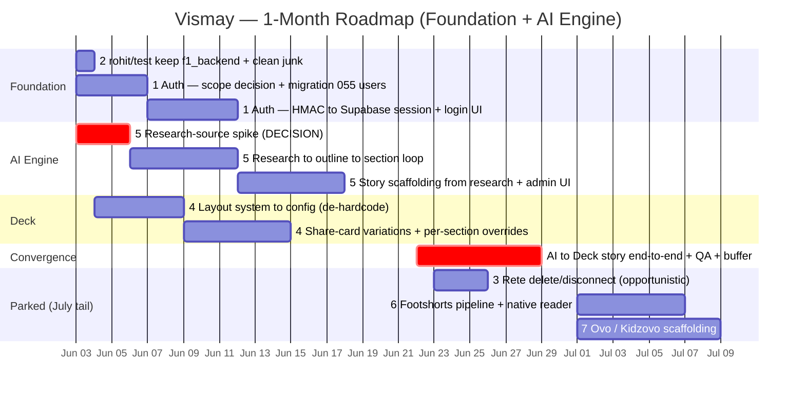

# Vismay — 1-Month Roadmap (June 2026)

**Window:** Jun 3 – Jun 30, 2026 (~4 weeks / ~20 working days)
**Tracks:** 3–4 parallel
**Strategy:** Foundation-first · go deep on the content engine, park the rest
**In-month focus:** ② Rohit integration → ① Auth → ⑤ AI pipeline → ④ Deck
**Payoff:** the generalized content engine producing a Deck-format story end-to-end (vizmaya pack)
**Parked → July tail:** ③ Rete · ⑥ Footshorts · ⑦ Ovo (③ as an opportunistic pickup)

**Related:** [vizf1-integration-vs-roadmap.md](vizf1-integration-vs-roadmap.md) (scoping comparison) · [generalized-content-engine.md](generalized-content-engine.md) (the engine reframe) · [vizf1-ai-pipeline-integration.md](vizf1-ai-pipeline-integration.md) (original spec) · [deck-layouts-de-hardcode.md](deck-layouts-de-hardcode.md) (④ layouts) · [deck-stage-subjects-objects.md](deck-stage-subjects-objects.md) (④ stage tier)

---

## Update — Jun 4, 2026

Early-week progress shifts the plan:

- **① Auth — done ~1.5 weeks early.** Per-user Supabase auth shipped (PR #161), with an **email allowlist** because the project is shared with footshorts' open consumer signup. This frees Track A capacity.
- **② rohit/test** — merged (#155); junk-file cleanup in PR #164. `f1_backend` kept as the ⑤ donor.
- **④ Deck — kicked off.** Layout **affordances** shipped (PR #162: the 8 deck layouts got real region geometry + inline regions + a `/layouts` gallery; doc #163). ④ now **also** carries a new **subjects/objects Tier 1** — generalize the map's persistent-instance pattern into a first-class **2D screen-space entity tier** with per-beat state tracks + lifetimes (see [deck-stage-subjects-objects.md](deck-stage-subjects-objects.md)). Flat only; 3D tiers are parked.

**Honest capacity trade-off:** auth landing early is what makes room for the ④ stage work. But Tier 1 grows ④ and competes with the ⑤ research→render convergence for the back half of June — and **⑤ is still gated by Decision 2** (research source). Tier 1 is feasible *as a ④ extension* only if ⑤ stays scoped; if ⑤ expands, Tier 1 slips to the July tail with the 3D tiers.

---

## Update — Jun 11, 2026

⑤ reached the W4 convergence payoff ~2 weeks early — the composer ships Deck/mapStory stories end-to-end (#172→#188: canvas-native DB-backed compose, two-pass charts, choropleth/pins maps, eval harness + layout lint). Decision 2 resolved as **uploaded sources** (text + PDF vision + URLs). ① Auth also overshot scope (#161/#168/#169 — per-vertical admin login; `docs/auth.md` needs updating). The freed back-half capacity goes to two new sub-tracks:

- **⑤b — Compose UX + reuse** (~14–22h):
  - **Research & outline design pass** — `ComposeFlowPanel.tsx` is one 1,046-line text-heavy accordion serving two contexts (canvas drawer + editor tab); needs typographic hierarchy, outline-entry cards, source/angle/chart previews.
  - **Angles → new story** — angles are per-story `compose_state` JSONB; add cross-story accessors + a "start from angle" seed path on route 0 + picker UI (unchosen angles are the asset).
  - **Stories/epics as research sources** — extend `SourceKind` with `'story'` (additive migration on the 056 CHECK constraint), extractor mapping `getStoryContent()` → `SourceDoc`, sources-route branch, picker UI.
- **③ Rete finishing — promoted from opportunistic to committed** (~8–14h): unify the Add affordance (AddMenu already centralizes pickers, but 6 right-click-only junction triggers via 3 dispatch makers — discoverability is the bug); collapsible content node (fixed 150px / 8-line truncate today); JSON-rendering fixes (chart-data preview bypasses `safeYamlStringify`, no try/catch); plus the original delete/disconnect gap (~60% missing: no user-facing delete on layers/regions/overrides).

**Trade-off:** this consumes the capacity ⑤ freed. **④b subjects/objects Tier 1 formally slips to the July tail** with the 3D tiers (per the Jun 4 condition — ⑤ expanded), and the full layout-system-to-config de-hardcode stays parked unless W4 has room.

---

## Update — Jun 13, 2026

A standings-grid rendering bug surfaced a structural debt: **`vizmaya-fyi` is doing double duty** — it's the vizmaya.fyi consumer brand *and* the universal headless render surface every vertical iframes into (consumer `/editorial/<slug>` routes are facades; the admin canvas signs all preview iframes against `vizmayaPublicUrl`). The per-vertical wiring that makes that work is hand-copied across ≥4 uncoordinated sites and silently drifts — confirmed by an f1/footshorts Tailwind `@source` gap (collapsed the standings grid, fixed in PR #219) and a `starship` loader missing from both admin sites. Full writeup: [vertical-registration-drift.md](vertical-registration-drift.md).

Splits into two responses:

- **A — vertical registry (debt paydown, cheap).** One declarative source of truth every site consumes; `@source` lists generated from it. Retires the drift bug *class* with no behavior change (~4–7h). Plan: [vertical-registry-plan.md](vertical-registry-plan.md). Fits opportunistically in W3/W4 buffer; **not** on the convergence critical path.
- **⑧ / C — extract the render engine (north star, NOT June).** Pull the vertical-agnostic render surface (StoryShell, autoplay/capture, PDF/video/audio dispatch) into its own app/package so `vizmaya.fyi` becomes just *one* consumer of it — resolving the dual-identity coupling that makes "vizf1 depends on *vizmaya*" feel wrong. Overlaps the engine reframe in [generalized-content-engine.md](generalized-content-engine.md) and the render-surface migration docs ([render-templates.md](render-templates.md), [fly-compute-migration.md](fly-compute-migration.md), [gcp-render-migration.md](gcp-render-migration.md)). **Parked → July+**; do it once the dual identity actually constrains (e.g. vizmaya.fyi wants engine-divergent behavior, or a 5th+ vertical lands). Avoid the tempting-but-wrong inverse — rendering each vertical natively in its own app duplicates the whole capture pipeline N times.

**Capacity:** neither competes with the W4 ⑤→④ convergence payoff. A is buffer-funded debt paydown; ⑧ is explicitly post-June.

---

## Update — Jun 23, 2026

W4 opened by landing the month's payoff **and** pulling the post-June north star forward. The in-month focus (① ② ④ ⑤) is delivered — mostly early — and the ⑤→④ convergence is real: the composer emits Deck/mapStory stories end-to-end. What's new since Jun 13:

- **⑧ render-engine extraction — DONE, ahead of its own trigger.** Jun 13 parked ⑧ to "July+, once the dual identity actually constrains." It shipped anyway. The vertical-agnostic render surfaces (share / report / slides / autoplay / canvas-frame) are extracted into **`@vismay/render-surface`** + a standalone **`apps/render`** service, and every signing site resolves **per-surface via `RENDER_SURFACE_URL_<SURFACE>`** (strangler flip, registry-resolved in `@vismay/verticals`). `vizmaya.fyi` is no longer doing double duty — it's now just *one* consumer of the engine. **Live in prod** at `https://render.vismay.xyz` (signed-URL gated); all 5 surfaces + the PDF download path flipped and verified end-to-end. Combined with the **A vertical-registry paydown** (also done), this closes the drift bug *class* the Jun 13 standings-grid bug exposed — a month+ ahead of schedule.
  - PRs #268→#271 (per-app resolution → extract `@vismay/render-surface` → scaffold `apps/render` → per-surface repoint), consolidated to `main` via #317, plus #319 (`apps/render/.env.example`) and #320 (PDF report/slides cutover — a `content-source` handler change, **not** the workflow-default flip the plan assumed). Ops facts: [render-templates.md](render-templates.md).
  - **Out of scope (correctly):** `render-video.yml` stays on vizmaya.fyi — video capture drives the public `/story` reader, which was never extracted. The 5 thin-mount surface routes in vizmaya-fyi remain as a zero-cost revert fallback.
  - **Gotcha logged:** merging the stack near-simultaneously merged each PR into its *parent branch*, not `main` (GitHub auto-retarget never fired) — only the foot reached `main` until the #317 consolidation caught it.
- **③ Rete finishing — done** (#193: user-facing delete for layers / regions / override seeds — the original ~60% delete/disconnect gap closed).
- **④b subjects/objects Tier 1 — pulled back in and SHIPPED** (the one item Jun 11 slipped to July). The Deck "stage" — a 3rd persistent tier of authorable subjects (interactive, z-focus) + objects (ambient decor) that flow across beats with enter/exit lifetimes + per-beat transform tracks — landed **flat 2D**, with the data model authored **3D-ready** (reserved `position3d`/`quaternion`/`camera`) so Tier 2's real-3D bodies need no re-authoring. `@vismay/viz-engine` `resolveStage` + `StageVizSlot`, mounted via `defaults.stage` (no render-surface changes); validated on a `_demo-stage` deck incl. z-focus + capture snap. PR #321.
- **Parked items over-ran scope (in a good way):** ⑥ Footshorts saw heavy build-out (share-card composer suite, mobile, Brandfetch logos, recaps, football-data) despite its July park; ⑦ Ovo/Kidzovo got opportunistic pickup (`kidzovo-stories-live`, per-`.riv` input schemas).

**Honest state:** with ④b Tier 1 now pulled back in, the in-month plan is effectively **complete and over-delivered**. The only deferral left is the ④b **3D tiers** — Tier 2 (fixed-z 3D, the real starship body) and Tier 3 (z-traversal-lite) — which were always July+ and stay there (the Tier-1 schema is authored 3D-ready so they don't reopen the data model). ⑤ converging early and ⑧ landing freed the capacity that made the ④b pull-in possible.

**Remaining W4:** (1) optional **decommission** — drop the vizmaya-fyi thin-mount surface routes once `apps/render` burns in; (2) convergence QA/buffer; (3) doc hygiene — `docs/auth.md` refresh (flagged Jun 11) + this entry.

---

## Three findings that reframe the plan

- **① "Auth to viz-admin" actually targets `apps/admin`.** `packages/viz-admin` is a *component library* with no auth boundary — the real auth lives in `apps/admin/lib/adminAuth.ts` (HMAC cookie). `@supabase/supabase-js` is already wired in `packages/content-source` and vizmaya-fyi, so the gap is a users table (migration 055) + a session-store swap, not a from-scratch integration.
- **② rohit/test is purely additive (3 commits, ~36K insertions, 0 deletions).** ⚠️ *Correcting the earlier read:* the bulk is `f1_backend/` — a **fully-populated ~35K-LOC reference implementation** (Python AI pipeline, Express backend, Vite frontend), **not** an empty scaffold, and **no footshorts deps are removed**. It isn't a pnpm-workspace member, so it never builds. This is a **trivial keep-and-clean, not a fraught merge** — and `f1_backend` is the *donor* for the content engine (⑤), not something to drop. Cleanup = delete 3 empty junk files + relocate one stray config.
- **③ The AI engine (⑤) is best built generic-first, with `f1_backend` as a donor — not a vizf1-specific port.** ⑤ becomes one generalized *research→render* engine (`packages/story-pipeline`) that recycles f1_backend's GraphSpec/ContentBlock contract + curation UX (charts rebuilt on ECharts) and ports its grounding heuristics as the trust spine; each vertical is a thin `DomainPack`. vizmaya is the June consumer; vizf1 is the first proof-of-seam. See [generalized-content-engine.md](generalized-content-engine.md).

---

## Gantt



### Inline-readable version

```
TRACK / ITEM                    │  W1      W2      W3      W4    │  Jul+
                                │  Jun3    Jun10   Jun17   Jun24 │  (tail)
────────────────────────────────┼───────────────────────────────┼─────────
FOUNDATION
 ②  rohit/test keep+clean        │  █                            │
 ①  Supabase Auth (apps/admin)   │  █████████████                │
AI ENGINE
 ⑤  research→render engine ⚡    │  ███████████████████████      │
 ④  Deck format grow             │      ███████████████          │
CONVERGENCE  ← the month's payoff
 ★  AI→Deck story E2E + QA        │                    ██████████ │
PARKED → spills to July
 ③  Rete delete/disconnect       │                   ░░░ opportun.│
 ⑥  Footshorts pipeline          │                               │  ▒▒▒▒▒▒
 ⑦  Ovo (Kidzovo) scaffold       │                               │  ▒▒▒▒▒▒
⚡ critical path   ░ opportunistic   ▒ parked
```

---

## Track breakdown

### Track A — Platform (you): ① Supabase Auth · ~8–12h
First action: decide scope (decision 1) → write migration 055 (`auth.users`) → add `@supabase/auth-helpers-next` → swap the HMAC cookie in `apps/admin/middleware.ts` for a Supabase session, keeping the `.vismay.xyz` cookie domain. Ships end of W2. Frees this person to take the opportunistic Rete fix in W3.

### Track B — Canvas/Deck (Rohit + 1): ② → ④ · ~16–22h
W1: merge rohit/test (purely additive — **keep** `f1_backend/` as the engine donor; just delete the 3 empty junk files; no footshorts deps were removed), run tests. W1–W3: Deck grow, starting with the highest-leverage move — **de-hardcode the layout list** in `packages/viz-engine/src/foregroundLayouts.ts` (currently ~30 layouts in code), which unblocks share-card variations + per-section overrides surfaced in `apps/admin/components/vizmaya/DeckComposerPanel.tsx`.

### Track C — AI engine (1): ⑤ generalized research→render engine · ~12–20h
W1: **research-source spike** (the gating blocker — decision 2). W1–W3: build the generic research→outline→multi-section→render loop on `packages/ai-gateway`'s `generateText({schema})`, scaffolded as `packages/story-pipeline` behind a `DomainPack` seam. Recycle f1_backend's GraphSpec/ContentBlock contract + grounding heuristics (claim-verifier, context-narrowing, coherence judge) as the trust spine; clone the per-asset generate route at `apps/admin/app/api/vizmaya/stories/[slug]/assets/generate/route.ts` (note: there is no `section-generate` route or `appendStorySection` helper — those names don't exist in the repo). vizmaya is the June `DomainPack`; vizf1 is the first proof. See [generalized-content-engine.md](generalized-content-engine.md).

### W4 — Convergence (all)
Wire ⑤ to emit a ④ Deck-format story end-to-end, QA, bugfix, buffer. The deliberate intersection of the two scope picks — the "content engine" working as one thing.

---

## Effort & state reference

| # | Item | Target location | Current state | Effort | In month? |
|---|------|-----------------|---------------|--------|-----------|
| 1 | Supabase Auth | `apps/admin` (not viz-admin) | ~5% | 8–12h | ✅ |
| 2 | Merge rohit/test (keep `f1_backend` donor) | branch `rohit/test` | additive · 0 deletions | ~1h | ✅ |
| 3 | Rete delete/disconnect | `apps/admin/components/vizmaya/canvas` | ~40% | 3–6h | ⚠️ opportunistic |
| 4 | Grow Deck format — layouts | `packages/viz-engine`, `apps/admin` | shipped (#162/#163) | 10–18h | ✅ |
| 4b | Deck stage — subjects/objects **Tier 1** (2D persistence) | `packages/viz-engine` (+ `story-reader`) | ~5% · design only | 10–16h | ✅ if ⑤ stays scoped |
| 5 | Generalized research→render engine | `packages/story-pipeline`, `ai-gateway`, `apps/admin/api` | ~25% | 12–20h | ✅ |
| 6 | Footshorts pipeline | `apps/footshorts`, `verticals/footshorts-viz` | ~75% | 12–20h | ⛔ parked |
| 7 | Ovo / Kidzovo scaffold | `docs/kidzovo-vertical-plan.md` (greenfield) | ~10% | 12–16h | ⛔ parked |

---

## Critical path & the 3 decisions that firm this up

1. **Auth scope (gates Track A):** simplest is admin password → Supabase email/password session. The bigger version is team SSO/OIDC (Google Workspace) with a user-management UI. First fits the month; second eats ~+1 week.
2. **Research source for ⑤ (gates Track C — can't start without it):** web search? a news/data API? uploaded documents? The single biggest unknown in the plan.
3. **rohit/test — keep `f1_backend`?** *Resolved: yes.* It's a real ~35K-LOC reference impl (not an empty scaffold) and the donor for ⑤'s engine; not a pnpm-workspace member, so it never builds. The merge is purely additive (0 deletions — the "removed footshorts deps" concern was unfounded). Only cleanup: delete 3 empty junk files (`_probe_copy.txt`, `_snip.txt`, `vismay_tc.log`) + relocate `paris-road-to-budapest.config.yaml`.

---

*Generated June 3, 2026 · scope basis: 3–4 tracks, 1-month horizon, foundation-first, "foundation + AI engine only".*
